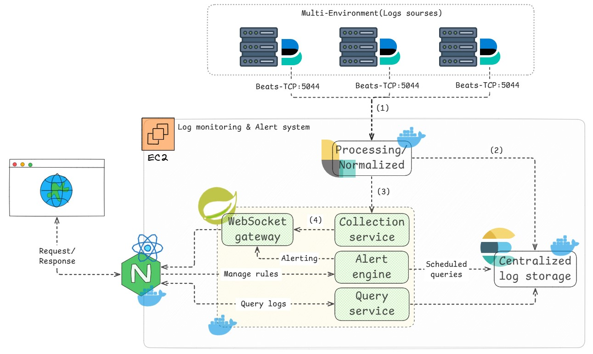

# 📊 VDT Centralized Log Management — Hệ thống giám sát log & cảnh báo tập trung

[]()
[]()
[]()
[](https://www.elastic.co/)
[]()
[]()

## **VDT Centralized Log Management** là hệ thống hỗ trợ **thu thập, tìm kiếm log tập trung và cảnh báo theo thời gian thực**, giúp đội vận hành phát hiện sự cố sớm và giám sát hệ thống hiệu quả mà không cần truy cập thủ công trên từng server.

## 🎯 Mục tiêu của dự án

- 📥 **Thu thập log tập trung:**
  Gom log từ nhiều service/ứng dụng khác nhau qua Filebeat → Logstash → Elasticsearch, thay vì phải soi log rải rác trên từng server.

- 🔍 **Tìm kiếm & truy vấn linh hoạt:**
  Cung cấp API tìm kiếm log theo **environment**, **service**, **application**, **log level**, **từ khóa**, hỗ trợ **cursor-based pagination** cho tập dữ liệu lớn.

- 🚨 **Cảnh báo thông minh theo pipeline:**
  Xây dựng **Alert Rule Engine** theo pipeline `FETCH_ES_DATA → MATH → THRESHOLD`, kèm cơ chế **cooldown/anti-spam** để tránh cảnh báo trùng lặp.

- 📡 **Streaming log thời gian thực:**
  Đẩy log và cảnh báo mới về dashboard ngay lập tức qua **WebSocket (STOMP)**, không cần refresh trang.

- 📊 **Dashboard trực quan:**
  Giao diện quản lý log & alert rule dễ theo dõi, hỗ trợ vận hành/giám sát hệ thống nhanh chóng.

---

## 🛠️ Công nghệ sử dụng

| Thành phần | Công nghệ | Chức năng | Ưu điểm |
| ---------- | --------- | --------- | ------- |
| **Frontend** | ⚛️ React + Vite + TailwindCSS + TanStack Query | Xây dựng dashboard hiển thị log & alert, gọi REST API và WebSocket. | Hiệu năng cao ⚡, dev server nhanh, UI hiện đại và responsive 📱. |
| **Backend** | ☕ Java Spring Boot (Java 21) | Xử lý logic thu thập/tìm kiếm log, quản lý alert rule, expose REST API & WebSocket. | Mạnh mẽ 💪, dễ mở rộng, hỗ trợ RESTful API chuẩn hóa 🌐. |
| **Realtime** | 🔌 WebSocket (STOMP) | Đẩy log & cảnh báo mới về client theo thời gian thực. | Độ trễ thấp, trải nghiệm streaming mượt. |
| **Lưu trữ & tìm kiếm** | 🔎 Elasticsearch | Lưu trữ, đánh chỉ mục và tìm kiếm log tốc độ cao. | Truy vấn full-text nhanh, mở rộng ngang tốt. |
| **Thu thập log** | 🪵 Logstash + Filebeat | Thu thập, xử lý và forward log từ nhiều nguồn về Elasticsearch. | Pipeline linh hoạt, hỗ trợ nhiều input/output. |
| **Triển khai** | 🐳 Docker + AWS EC2 | Đóng gói và triển khai toàn bộ hệ thống. | Tính di động cao 🚀, dễ mở rộng và CI/CD 🧱. |

---

## 💡 Tính năng nổi bật

✅ **Thu thập log tập trung từ nhiều nguồn** (Filebeat/Logstash → Elasticsearch)

✅ **Tìm kiếm, lọc log đa tiêu chí** với cursor-based pagination

✅ **Thiết lập Alert Rule linh hoạt** (pipeline FETCH_ES_DATA → MATH → THRESHOLD)

✅ **Cơ chế cooldown/anti-spam** chống lặp cảnh báo

✅ **Lịch sử notification** theo từng rule

✅ **Streaming log & cảnh báo realtime** qua WebSocket (STOMP)

✅ **Dashboard trực quan hoá** log và cảnh báo

> 🧩 _VDT Centralized Log Management giúp đội vận hành phát hiện sự cố sớm hơn, chỉ với một dashboard duy nhất._

---

## 🏗️ Kiến trúc hệ thống

## 

## 🧩 Yêu cầu (Prerequisites)

Để chạy dự án **VDT Centralized Log Management**, hãy đảm bảo rằng bạn đã cài đặt các công cụ sau trên máy:

- 🧰 **Git** – để clone và quản lý mã nguồn.
- ☕ **Java JDK ≥ 21** – chạy backend (Spring Boot).
- 🏗️ **Maven** – build và quản lý dependency của backend.
- 🧩 **Node.js ≥ 22** – chạy frontend (React + Vite).
- 📦 **npm** – quản lý và cài đặt thư viện frontend.
- 🐳 **Docker & Docker Compose** – khởi chạy hạ tầng ELK (Elasticsearch, Logstash) trong container.

---

## Hướng dẫn cài đặt & chạy nhanh (mẫu)

## 1. Clone repository

```bash
git clone https://github.com/NgnTienDat/VDT-Centralized-Log-Management.git
cd VDT-Centralized-Log-Management
```

## 2. Backend (Java — Spring Boot)
<!-- 
### 🧾 Cấu hình môi trường

Trước khi chạy backend, hãy kiểm tra/thiết lập các biến cấu hình tương ứng trong `application.yaml`:

```bash
SERVER_PORT=8082

ES_HOST=your_elasticsearch_host
ES_PORT=9200

LOGSTASH_HOST=your_logstash_host
```

> ⚠️ Đây là các biến tham khảo — mình chưa có `application.yaml` thật nên chưa liệt kê chính xác 100%. Gửi file đó nếu bạn muốn mình điền đúng tên biến. -->

```bash
cd log-monitor-backend
mvn clean install
mvn spring-boot:run
```

## 3. Frontend (React + Vite)

### 🧾 Cấu hình môi trường

Tạo tệp `.env` trong thư mục `log-monitor-frontend` với nội dung sau:

```bash
VITE_API_BASE_URL=http://localhost:8082/api/v1
VITE_WS_URL=http://localhost:8082/ws
```

```bash
cd log-monitor-frontend
npm install
npm run dev
```

## 4. Hạ tầng ELK (Docker)

```bash
cd infras-config
docker compose up -d
```

## 5. Đẩy log ứng dụng vào hệ thống bằng Filebeat (ví dụ: `payment-service`)

`payment-service` là app Spring Boot demo đi kèm repo, dùng để minh hoạ cách một service bất kỳ tích hợp vào hệ thống log tập trung. Khi tích hợp app khác, làm tương tự:

```bash
cd payment-service
docker compose up -d
```

**Các file cần kiểm tra khi tích hợp:**

| File | Vai trò |
| --- | --- |
| `src/main/resources/application.yml` | Khai báo nơi ghi log ra file: `logging.file.name` |
| `src/main/resources/logback-spring.xml` | Định dạng (pattern) từng dòng log ghi ra file — **phải khớp với pattern Logstash đang parse** |
| `infras/filebeat/filebeat.yml` | Cấu hình Filebeat: đọc log ở đâu, gộp multiline stacktrace thế nào, gắn field gì, đẩy đến Logstash host nào |
| `docker-compose.yml` | Khai báo volume chia sẻ thư mục log giữa container app ↔ container Filebeat, và network dùng chung với Logstash |

> ⚠️ **Lưu ý quan trọng khi tích hợp:**
> - **Đường dẫn log phải khớp ở cả 3 nơi:** `application.yml` (`logging.file.name` → `./logs/system.log`) → volume trong `docker-compose.yml` (mount `./logs` vào cả container app `/app/logs` lẫn container Filebeat `/var/log/system-log:ro`) → `paths` trong `filebeat.yml` (`/var/log/system-log/*.log`). Lệch một trong ba chỗ này, Filebeat sẽ không đọc được log.
> - **Network phải dùng chung với Logstash:** `docker-compose.yml` của service khai báo `log-monitor-network` là `external: true`, nghĩa là network này phải được tạo sẵn trước đó (bởi `infras-config` ở bước 4). Chưa chạy hạ tầng ELK thì service sẽ không join được network và không gọi tới `log-monitor-logstash:5044`.
> - **Log nhiều dòng (stacktrace) phải được gộp đúng ở Filebeat:** `filebeat.yml` dùng `multiline` parser, nhận diện dòng mới bắt đầu bằng timestamp (`^[0-9]{4}-[0-9]{2}-[0-9]{2}`); dòng nào không khớp (ví dụ dòng stacktrace) sẽ được gộp vào log entry ngay trước đó, tránh bị tách thành nhiều bản ghi rời rạc.
> - **Metadata `environment` / `app` / `service`** được Filebeat gắn thêm qua `processors.add_fields`, dùng để lọc/tìm log theo service trên dashboard (khớp với query param `environment`, `appName`, `serviceName` của API `/api/v1/logs`). Đổi tên field ở đây thì phải đổi tương ứng bên cấu hình Logstash.
> - **Format log phải khớp hai chiều** giữa nơi sinh log (`logback-spring.xml`) và nơi parse log (filter của Logstash) — xem Log Template bên dưới.

### 📐 Log Template hệ thống đang hỗ trợ

Pattern log chuẩn mà `payment-service` (và các service muốn tích hợp) cần tuân theo, định nghĩa trong `logback-spring.xml`:

```
%d{yyyy-MM-dd HH:mm:ss.SSS} [%thread] [%X{traceId:-NO_TRACE}] %-5level %logger{36} - %msg%n
```

Ví dụ một dòng log thực tế:

```
2026-07-09 12:22:36.123 [http-nio-8083-exec-1] [a1b2c3d4e5f6g7h8] INFO  com.ntd.payment.LogController - Payment processed successfully
```

| Phần trong pattern | Field tương ứng | Ý nghĩa |
| --- | --- | --- |
| `%d{yyyy-MM-dd HH:mm:ss.SSS}` | `eventTimestamp` | Thời điểm ghi log |
| `[%thread]` | `thread` | Tên thread xử lý request |
| `[%X{traceId:-NO_TRACE}]` | `traceId` | Gắn qua `TraceIdFilter`, dùng để trace xuyên suốt 1 request; mặc định `NO_TRACE` nếu không có |
| `%-5level` | `logLevel` | `DEBUG` / `INFO` / `WARN` / `ERROR` |
| `%logger{36}` | `logger` | Thường là tên class phát sinh log |
| `%msg` | `message` | Nội dung log |

> Nếu service của bạn dùng pattern log khác, cần cập nhật tương ứng filter/grok pattern phía Logstash — nếu không log sẽ bị parse sai hoặc rơi vào field mặc định.

---

## ⚙️ Cấu Hình Ports

| 🚦 **Dịch Vụ** | 💻 **Cổng (Development)** | 📝 **Mô Tả** |
| :--------------- | :------------------------: | :------------ |
| ⚙️ **Backend (Spring Boot)** | `8082` | REST API + WebSocket (STOMP); Swagger UI tại `/swagger-ui.html` |
| 💻 **Frontend (React / Vite)** | `5173` | Giao diện dashboard chính |
| 🔎 **Elasticsearch** | `9200` | Lưu trữ & tìm kiếm log |
| 🪵 **Logstash** | `5044` | Pipeline thu thập log |
| 🧪 **payment-service (demo)** | `8083` | App demo sinh log để test hệ thống |

> ⚠️ Chỉ port của backend được xác nhận (lấy từ swagger config). Gửi `infras-config/docker-compose.yml` để mình điền chính xác các dòng còn lại.

---

## 🔌 Các Endpoint chính

### Endpoint Backend

- **Base URL (dev):** `http://localhost:8082/api/v1`
- **Swagger UI:** `http://localhost:8082/swagger-ui.html`

**Log Collector**

| Method | Endpoint | Mô tả |
| ------ | -------- | ----- |
| `POST` | `/internal/logs/ingest` | Nhận log gửi vào từ Logstash/nguồn thu thập. Payload gồm `docId`, `traceId`, `logLevel` (`DEBUG/INFO/WARN/ERROR`), `environment`, `serviceName`, `appName`, `thread`, `logger`, `message`, `eventTimestamp`, `hostName` |

**Log Query**

| Method | Endpoint | Mô tả |
| ------ | -------- | ----- |
| `GET` | `/logs` | Tìm kiếm log theo `environment`, `appName`, `serviceName`, `logLevel`, từ khóa `q`; phân trang cursor qua `before`/`beforeId`, `size` |
| `GET` | `/logs/{id}` | Lấy chi tiết 1 log theo `id` (param `by`, mặc định `id`) |
| `GET` | `/logs/services` | Danh sách service đang có log |
| `GET` | `/logs/applications` | Danh sách application đang có log |
| `GET` | `/es/group-by-fields` | Danh sách field group-by trên index Elasticsearch (mặc định `sys-logs-*`), dùng khi cấu hình alert rule |

**Alert Rule**

| Method | Endpoint | Mô tả |
| ------ | -------- | ----- |
| `GET` | `/alerts/rules` | Lấy danh sách tất cả alert rule |
| `POST` | `/alerts/rules` | Tạo alert rule mới (pipeline `FETCH_ES_DATA → MATH → THRESHOLD`, `intervalMinutes`, `repeatIntervalMinutes`, `notificationTemplate`, ...) |
| `GET` | `/alerts/rules/{ruleId}` | Xem chi tiết 1 rule |
| `PATCH` | `/alerts/rules/{ruleId}` | Cập nhật rule (tên, interval, trạng thái active, pipeline steps, notification template...) |
| `DELETE` | `/alerts/rules/{ruleId}` | Xoá rule |
| `GET` | `/alerts/rules/{ruleId}/notifications` | Lịch sử notification đã gửi của 1 rule |

### 🌱 Quy Trình Đóng Góp

#### 1. Fork Repository

Fork repository của dự án trên GitHub để tạo bản sao trong tài khoản của bạn.

```bash
# Fork repository trên GitHub
# Clone về máy local
git clone https://github.com/<your-username>/VDT-Centralized-Log-Management.git
cd VDT-Centralized-Log-Management
```

#### 2. Tạo nhánh mới

Tạo một branch mới để phát triển tính năng hoặc sửa lỗi.

```bash
# Tạo và chuyển sang branch mới
git checkout -b feat/<new-feature>

# Ví dụ
git checkout -b feat/alert-cooldown
```

#### 3. Commit Thay Đổi

Sau khi chỉnh sửa, hãy commit các thay đổi với thông điệp rõ ràng.

```bash
# Thêm file đã thay đổi
git add .

# Commit với message rõ ràng
git commit -m "feat: add new feature"
```

#### 4. Push Branch

```bash
# Push lên repository của bạn
git push -u origin feat/<new-feature>
```

#### 5. Tạo Pull Request (PR)

1. Truy cập repository **gốc** trên GitHub.
2. Chọn **"New Pull Request"**.
3. Chọn branch của bạn để merge.
4. Điền mô tả chi tiết cho thay đổi của bạn.
5. Gửi **Pull Request (PR)** và chờ phản hồi từ tác giả. 🚀

---

## 🧾 Giấy Phép

*(Repo hiện chưa có file `LICENSE` — bổ sung nếu dự án được public/phân phối chính thức.)*

---

## 📞 Liên Hệ

| 📬 **Phương Thức** | 📱 **Chi Tiết** |
| ------------------- | ---------------- |
| **Email** | [tie.dat2004@gmail.com](mailto:tie.dat2004@gmail.com) |

---

## 🪲 Báo Cáo Lỗi & Góp Ý

### 📝 Issues

Nếu bạn phát hiện lỗi hoặc có đề xuất tính năng mới, vui lòng tạo **Issue** tại:
👉 [GitHub Issues](https://github.com/NgnTienDat/VDT-Centralized-Log-Management/issues)

Mọi đóng góp và phản hồi đều rất được hoan nghênh 💡.

# Authors

- NgnTienDat — https://github.com/NgnTienDat
