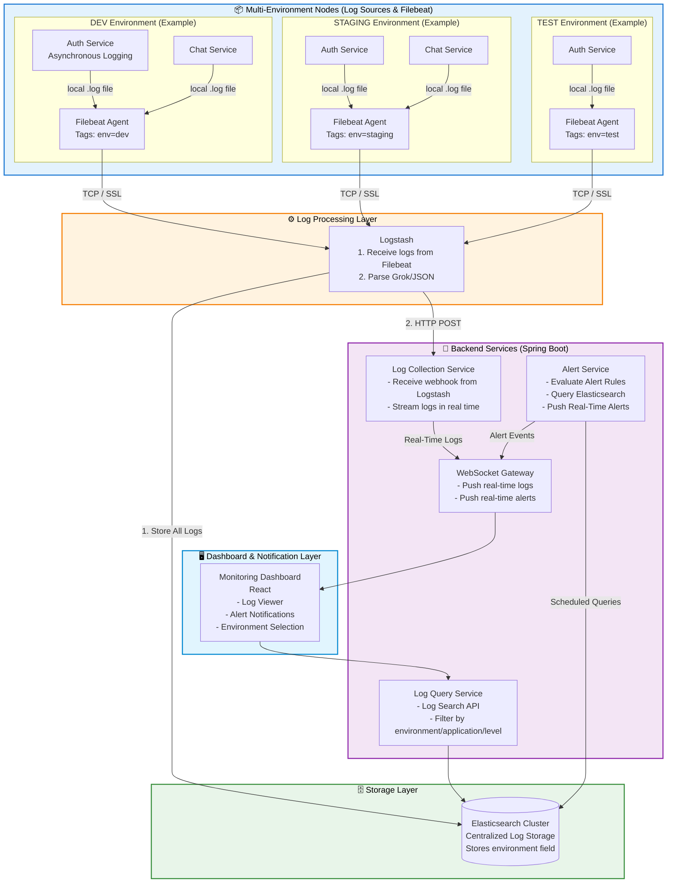

```mermaid  
flowchart TD

    %% =========================
    %% LOG PRODUCERS & AGENTS (MULTI-ENV)
    %% =========================
    subgraph SOURCES["📦 Multi-Environment Nodes (Log Sources & Filebeat)"]
        direction TB
         
        subgraph ENV_DEV["DEV Environment (Example)"]
            A1[Auth Service<br/>Asynchronous Logging] -->|local .log file| FB1[Filebeat Agent<br/>Tags: env=dev]
            A2[Chat Service] -->|local .log file| FB1
        end

        subgraph ENV_STAGING["STAGING Environment (Example)"]
            B1[Auth Service] -->|local .log file| FB2[Filebeat Agent<br/>Tags: env=staging]
            B2[Chat Service] -->|local .log file| FB2
        end
        
        subgraph ENV_TEST["TEST Environment (Example)"]
            C1[Auth Service] -->|local .log file| FB3[Filebeat Agent<br/>Tags: env=test]
        end
    end

    %% =========================
    %% PROCESSING LAYER
    %% =========================
    subgraph PROCESS["⚙️ Log Processing Layer"]
        LS[Logstash<br/>1. Receive logs from Filebeat<br/>2. Parse Grok/JSON]
    end

    %% =========================
    %% STORAGE LAYER
    %% =========================
    subgraph STORAGE["🗄️ Storage Layer"]
        ES[(Elasticsearch Cluster<br/>Centralized Log Storage<br/>Stores environment field)]
    end

    %% =========================
    %% BACKEND SERVICES
    %% =========================
    subgraph BACKEND["🧠 Backend Services (Spring Boot)"]

        QUERY[Log Query Service<br/>- Log Search API<br/>- Filter by environment/application/level]

        COLLECT[Log Collection Service<br/>- Receive webhook from Logstash<br/>- Stream logs in real time]

        ALERT[Alert Service<br/>- Evaluate Alert Rules<br/>- Query Elasticsearch<br/>- Push Real-Time Alerts]

        WS[WebSocket Gateway<br/>- Push real-time logs<br/>- Push real-time alerts]
    end

    %% =========================
    %% FRONTEND
    %% =========================
    subgraph FRONTEND_LAYER["🖥️ Dashboard & Notification Layer"]
        REACT[Monitoring Dashboard<br/>React<br/>- Log Viewer<br/>- Alert Notifications<br/>- Environment Selection]
    end

    %% =========================
    %% DATA FLOW
    %% =========================

    FB1 -->|TCP / SSL| LS
    FB2 -->|TCP / SSL| LS
    FB3 -->|TCP / SSL| LS

    LS -->|1. Store All Logs| ES
    LS -->|2. HTTP POST| COLLECT

    QUERY --> ES
    REACT --> QUERY

    COLLECT -->|Real-Time Logs| WS

    ALERT -->|Scheduled Queries| ES
    ALERT -->|Alert Events| WS

    WS --> REACT

    %% =========================
    %% COLORS
    %% =========================
    style SOURCES fill:#E3F2FD,stroke:#1976D2,stroke-width:2px,color:#000
    style PROCESS fill:#FFF3E0,stroke:#F57C00,stroke-width:2px,color:#000
    style STORAGE fill:#E8F5E9,stroke:#388E3C,stroke-width:2px,color:#000
    style BACKEND fill:#F3E5F5,stroke:#8E24AA,stroke-width:2px,color:#000
    style FRONTEND_LAYER fill:#E1F5FE,stroke:#0288D1,stroke-width:2px,color:#000
```