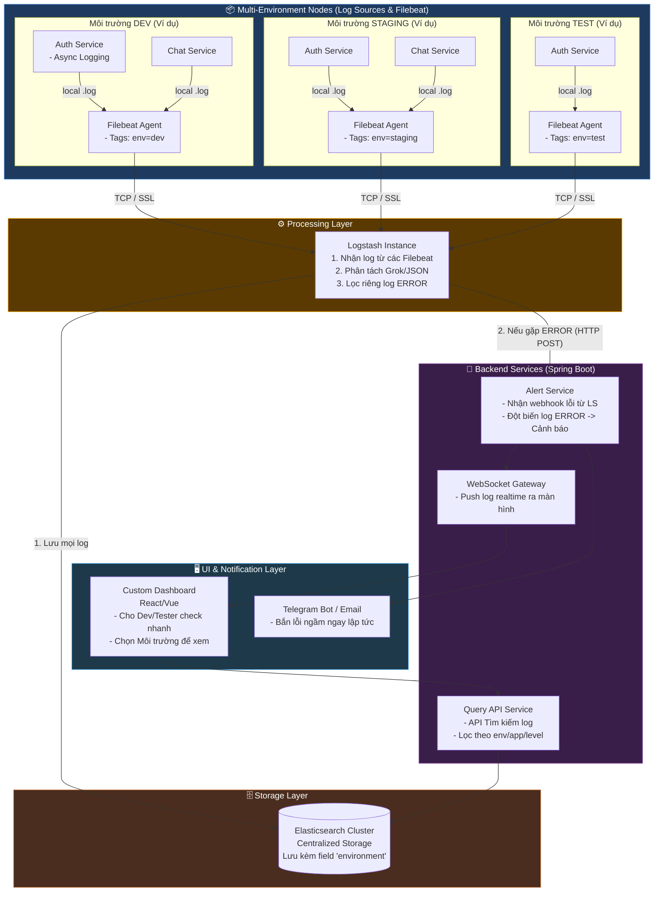

```mermaid
flowchart TD

    %% =========================
    %% LOG PRODUCERS & AGENTS (MULTI-ENV)
    %% =========================
    subgraph SOURCES["📦 Multi-Environment Nodes (Log Sources & Filebeat)"]
        direction TB
         
        subgraph ENV_DEV["Môi trường DEV (Ví dụ)"]
            A1[Auth Service\n- Async Logging] -->|local .log| FB1[Filebeat Agent\n- Tags: env=dev]
            A2[Chat Service] -->|local .log| FB1
        end

        subgraph ENV_STAGING["Môi trường STAGING (Ví dụ)"]
            B1[Auth Service] -->|local .log| FB2[Filebeat Agent\n- Tags: env=staging]
            B2[Chat Service] -->|local .log| FB2
        end
        
        subgraph ENV_TEST["Môi trường TEST (Ví dụ)"]
            C1[Auth Service] -->|local .log| FB3[Filebeat Agent\n- Tags: env=test]
        end
    end

    %% =========================
    %% PROCESSING LAYER (LOGSTASH)
    %% =========================
    subgraph PROCESS["⚙️ Processing Layer"]
        LS[Logstash Instance\n1. Nhận log từ các Filebeat\n2. Phân tách Grok/JSON\n3. Lọc riêng log ERROR]
    end

    %% =========================
    %% STORAGE LAYER
    %% =========================
    subgraph STORAGE["🗄️ Storage Layer"]
        ES[(Elasticsearch Cluster\nCentralized Storage\nLưu kèm field 'environment')]
    end

    %% =========================
    %% BACKEND SERVICES (SPRING BOOT)
    %% =========================
    subgraph BACKEND["🧠 Backend Services (Spring Boot)"]
        QUERY[Query API Service\n- API Tìm kiếm log\n- Lọc theo env/app/level]
        
        ALERT[Alert Service\n- Nhận webhook lỗi từ LS\n- Đột biến log ERROR -> Cảnh báo]
        
        WS[WebSocket Gateway\n- Push log realtime ra màn hình]
    end

    %% =========================
    %% FRONTEND & NOTIFICATION
    %% =========================
    subgraph FRONTEND_LAYER["🖥️ UI & Notification Layer"]
        REACT[Custom Dashboard\nReact/Vue\n- Cho Dev/Tester check nhanh\n- Chọn Môi trường để xem]
        TG[Telegram Bot / Email\n- Bắn lỗi ngầm ngay lập tức]
    end

    %% =========================
    %% FLOW DIRECTION
    %% =========================

    %% Filebeat các môi trường đẩy thẳng về cổng TCP của Logstash công ty
    FB1 -->|TCP / SSL| LS
    FB2 -->|TCP / SSL| LS
    FB3 -->|TCP / SSL| LS

    %% Logstash rẽ nhánh dữ liệu
    LS -->|1. Lưu mọi log| ES
    LS -- "2. Nếu gặp ERROR (HTTP POST)" --> ALERT

    %% Luồng Query & Hiển thị
    QUERY --> ES
    REACT --> QUERY
    
    %% Luồng Cảnh báo
    ALERT --> TG
    ALERT --> WS
    WS --> REACT

    %% =========================
    %% STYLE COLORS
    %% =========================
    style SOURCES fill:#1e3a5f,color:#fff,stroke:#4a90d9
    style PROCESS fill:#5a3a00,color:#fff,stroke:#ff9f00
    style STORAGE fill:#4a2d1e,color:#fff,stroke:#d9844a
    style BACKEND fill:#3a1e4a,color:#fff,stroke:#9b59b6
    style FRONTEND_LAYER fill:#1e3a4a,color:#fff,stroke:#3498db

```